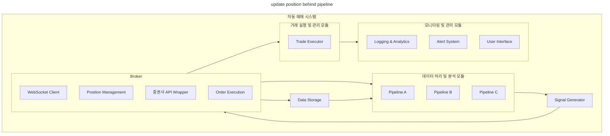

```mermaid
---
title: update position behind pipeline
---
graph TD
    subgraph 자동 매매 시스템
        K[Broker]
        K --> B[Data Storage]
        K --> C[데이터 처리 및 분석 모듈]
        B --> C
        subgraph C[데이터 처리 및 분석 모듈]
            D[Pipeline A]
            F[Pipeline B]
            G[Pipeline C]
        end
        C --> E[Signal Generator]
        E --> K
        subgraph K[Broker]
            A[WebSocket Client]
            K1[Position Management]
            K3[증권사 API Wrapper]
            K4[Order Execution]
        end
        K --> H[거래 실행 및 관리 모듈]
        subgraph H[거래 실행 및 관리 모듈]
            I[Trade Executor]
        end
        H --> L[모니터링 및 관리 모듈]
        subgraph L[모니터링 및 관리 모듈]
            M[Logging & Analytics]
            N[Alert System]
            O[User Interface]
        end
    end
```