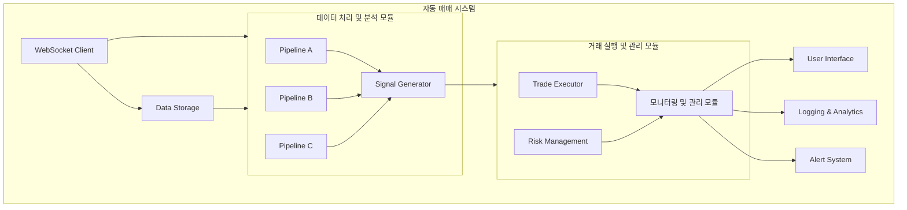
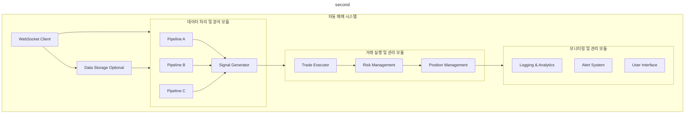
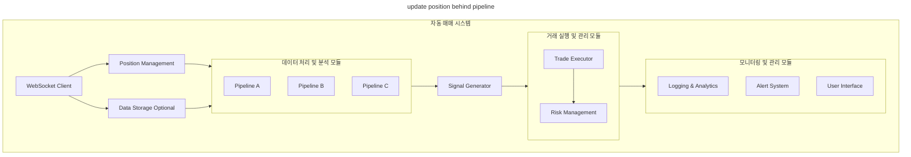

```mermaid
graph TD
    subgraph 자동 매매 시스템
        A[WebSocket Client] --> B[Data Storage]
        A --> C[데이터 처리 및 분석 모듈]
        B --> C
        subgraph C[데이터 처리 및 분석 모듈]
            D[Pipeline A] --> E[Signal Generator]
            F[Pipeline B] --> E
            G[Pipeline C] --> E
        end
        E --> H[거래 실행 및 관리 모듈]
        subgraph H[거래 실행 및 관리 모듈]
            I[Trade Executor] --> K[모니터링 및 관리 모듈]
            J[Risk Management] --> K
        end
        K --> L[User Interface]
        K --> M[Logging & Analytics]
        K --> N[Alert System]
    end

```

```mermaid
---
title: second
---
graph TD
    subgraph 자동 매매 시스템
        A[WebSocket Client] --> B[Data Storage Optional]
        A --> C[데이터 처리 및 분석 모듈]
        B --> C
        subgraph C[데이터 처리 및 분석 모듈]
            D[Pipeline A] --> E[Signal Generator]
            F[Pipeline B] --> E
            G[Pipeline C] --> E
        end
        E --> H[거래 실행 및 관리 모듈]
        subgraph H[거래 실행 및 관리 모듈]
            I[Trade Executor] --> J[Risk Management]
            J --> K[Position Management]
        end
        K --> L[모니터링 및 관리 모듈]
        subgraph L[모니터링 및 관리 모듈]
            M[Logging & Analytics]
            N[Alert System]
            O[User Interface]
        end
    end
```

```mermaid
---
title: update position behind pipeline
---
graph TD
    subgraph 자동 매매 시스템
        A[WebSocket Client] --> B[Data Storage Optional]
        A --> K[Position Management]
        K --> C[데이터 처리 및 분석 모듈]
        B --> C
        subgraph C[데이터 처리 및 분석 모듈]
            D[Pipeline A]
            F[Pipeline B]
            G[Pipeline C]
        end
        C --> E[Signal Generator]
        E --> H[거래 실행 및 관리 모듈]
        subgraph H[거래 실행 및 관리 모듈]
            I[Trade Executor] --> J[Risk Management]
        end
        H --> L[모니터링 및 관리 모듈]
        subgraph L[모니터링 및 관리 모듈]
            M[Logging & Analytics]
            N[Alert System]
            O[User Interface]
        end
    end
```